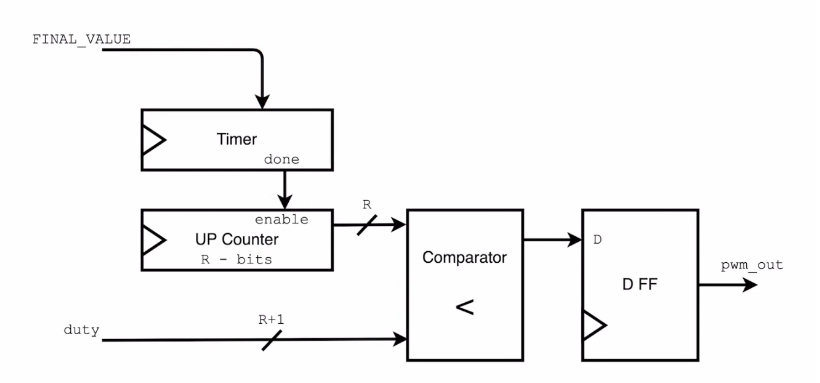

## 1. Memory
### 1.1. Vivado simualtion
```shell
cd /1_memroy/vivado_sim
make simulate
make waves
```
### 1.2. Cocotb simulation

```shell
cd /1_memroy/tb
make
```

## 2. PWM Design
The block diagram shows the full design of PWM
  <br>